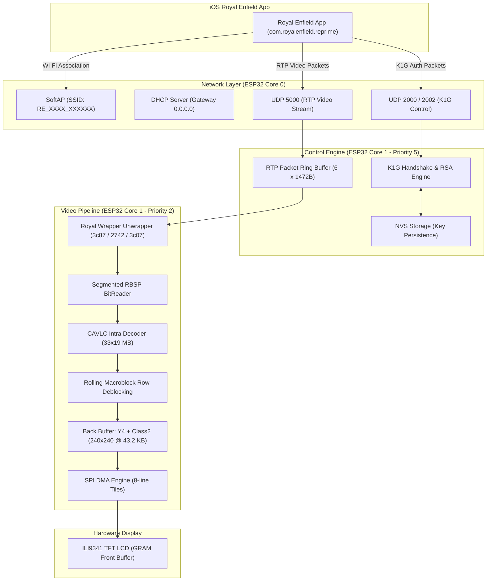

<div align="center">

# 🏍️ NavDash

### Reverse-Engineered Royal Enfield Tripper Navigation & Real-Time H.264 Video Engine for ESP32

[](https://www.espressif.com/)
[](https://platformio.org/)
[](docs/royal-video-stream-re.md)
[](docs/navdash-rtos-architecture.md)
[](#license)

<p align="center">
  <b>NavDash</b> is a high-performance embedded firmware and reverse-engineering research toolkit that emulates the <b>Royal Enfield Tripper / Meteor / Super Meteor / Himalayan Dash</b>. It negotiates the proprietary K1G cryptographic handshake over SoftAP Wi-Fi, ingests live RTP video streams, and decodes H.264 turn-by-turn map navigation directly onto an ILI9341 LCD using a zero-PSRAM rolling macroblock engine.
</p>

---

</div>

## 📌 Table of Contents

- [Overview](#-overview)
- [Key Features](#-key-features)
- [System Architecture](#-system-architecture)
- [Protocol Specification](#-protocol-specification)
  - [Network & SoftAP Topology](#1-network--softap-topology)
  - [Cryptographic Handshake (K1G)](#2-cryptographic-handshake-k1g)
  - [Video Stream & Royal Wrapper](#3-video-stream--royal-wrapper)
- [Memory Architecture (ESP32-D0WD Zero-PSRAM)](#-memory-architecture-esp32-d0wd-zero-psram)
- [Hardware Wiring & Pinouts](#-hardware-wiring--pinouts)
- [Build Environments & Flashing](#-build-environments--flashing)
- [Python Analysis & Reverse-Engineering Tools](#-python-analysis--reverse-engineering-tools)
- [Project Layout](#-project-layout)
- [Documentation Index](#-documentation-index)
- [License & Disclaimer](#-license--disclaimer)

---

## ⚡ Overview

The Royal Enfield Tripper and modern digital clusters (`com.royalenfield.reprime`) stream real-time vector map directions and navigation graphics over a dedicated Wi-Fi SoftAP link using a proprietary wrapper around RTP/H.264 and UDP control packets.

**NavDash** reverse-engineers the complete stack:
1. **Wi-Fi SoftAP & DHCP Gateway Spoofing**: Hosts the `RE_XXXX_XXXXXX` access point and forces cellular traffic routing on the mobile device.
2. **K1G RSA Authentication**: Implements the bidirectional UDP 2000/2002 RSA-1024 cryptographic handshake with Non-Volatile Storage (NVS) identity caching.
3. **Live H.264 Video Pipeline**: Unwraps custom Royal delimiters from UDP 5000, feeds fragments into a custom segmented RBSP bitreader, and performs rolling macroblock-row CAVLC decoding with horizontal/vertical in-loop deblocking.
4. **Sub-Frame TFT Presentation**: Direct DMA transfer to ILI9341 SPI displays without requiring large external PSRAM.

---

## ✨ Key Features

- 🔒 **Full K1G Protocol Emulation**: Handles `ANNOUNCE DUAL`, RSA public key delivery (`08/04` &rarr; `07/00`+`07/03`), and authentication confirmation (`08/00` &rarr; `07/01`).
- 🎬 **All-IDR Stream Processing**: Optimized specifically for Royal Enfield's unique H.264 stream profile (Baseline Profile 66, Level 2.1, 528x304 coded, 33x19 macroblocks, CAVLC entropy, all-IDR I-slices).
- 🧠 **Extreme Memory Efficiency**: Operates entirely in ~110 KB dynamic heap on standard ESP32-D0WD (non-PSRAM) chips using a 3-row rolling YUV buffer (38 KB) and 4-bit Luma + 2-bit Chroma classification cache (43.2 KB).
- 🛡️ **Fail-Safe Dual-Core RTOS**:
  - **Core 0**: lwIP network stack and Wi-Fi system operations.
  - **Core 1 (Priority 5)**: Control loop, pairing, and keepalive heartbeat.
  - **Core 1 (Priority 2)**: Worker task for H.264 packet processing and LCD rendering.
  - **Heap Guard**: Automatically drops video frames or suspends decoding if free heap falls below 100 KB / 80 KB to guarantee control link survival.
- 🛠️ **Comprehensive Research Toolkit**: Complete suite of Python CLI tools for COM capture logging, RTP reassembly, Annex-B extraction, and bitstream analysis.

---

## 🏗️ System Architecture



---

## 📡 Protocol Specification

### 1. Network & SoftAP Topology

| Parameter | Value / Behavior | Note |
| :--- | :--- | :--- |
| **SSID Format** | `RE_XXXX_XXXXXX` | Matches OEM Tripper Dash format |
| **WPA2 Password** | `12345678` (Default) | Configurable in `include/config.h` |
| **AP IP Address** | `192.168.1.1 / 24` | Local dash endpoint |
| **DHCP Gateway** | `0.0.0.0` | **Crucial**: Prevents iOS from dropping cellular mobile data |
| **Control Ports** | UDP `2000` (Dash Rx), UDP `2002` (iPhone Rx) | K1G packet exchange |
| **Video Port** | UDP `5000` (Dash Rx) | RTP H.264 transport |

### 2. Cryptographic Handshake (K1G)

```
iPhone (192.168.1.2)                          ESP32 Dash (192.168.1.1)
        |                                                 |
        |<============= UDP 2000 ANNOUNCE DUAL ===========|  (Periodic Broadcast)
        |                                                 |
        |--- UDP 2000: DHCP_LEASE or 06/08 -------------->|
        |<-- UDP 2002: AUTH_PUBKEY (08/04 -> 07/00+07/03) |  (RSA 1024-bit Key Exchange)
        |                                                 |
        |--- UDP 2000: AUTH_CONFIRM (08/00) ------------->|
        |<-- UDP 2002: AUTH_OK (07/01) -------------------|  (Pairing Locked & Saved)
        |                                                 |
        |  [ 8-Second Grace Period for NVS Flush ]        |
        |                                                 |
        |================= UDP 5000 =====================>|  (RTP H.264 Stream Begins)
```

### 3. Video Stream & Royal Wrapper

The stream received on UDP `5000` uses RTP payload type `96` wrapped with custom Royal Enfield header prefixes:

- **IDR Start Packet (`0x3C87`)**: Carries SPS (`0x27...`) + PPS (`0x28...`) + IDR Slice Start (`0x25...`).
- **Continuation Packet (`0x3C07`)**: Subsequent fragments of an open NAL unit.
- **SEI Packet (`0x2742`)**: Metadata and supplementary enhancement information (ignored by parser).

#### Coded Bitstream Parameters:
```text
Codec:             H.264 Baseline Profile (Profile IDC 66, Level 2.1)
Entropy Coding:    CAVLC (entropy_coding_mode_flag = 0)
Slice Structure:   All-IDR (I-slices only, no P/B reference frames required)
Dimensions:        Coded: 528 x 304 | Display Crop: 526 x 300
Macroblocks:       33 horizontal x 19 vertical (627 total MBs per frame)
Chroma Format:     YUV420 Planar
```

---

## 💾 Memory Architecture (ESP32-D0WD Zero-PSRAM)

Standard ESP32 microcontrollers have strictly limited internal SRAM. NavDash uses a **dynamic lifecycle allocation model**: zero video memory is allocated prior to a verified `AUTH OK`, preventing heap exhaustion during the crypto handshake.

```text
┌─────────────────────────────────────────────────────────────┐
│                   Dynamic Video Context (~110 KB)           │
├────────────────────────────────┬────────────────────────────┤
│ Component                      │ Allocated RAM (Bytes)      │
├────────────────────────────────┼────────────────────────────┤
│ Y4 + Class2 Back Frame         │ 43,200 B (240x240)         │
│ Rolling 3-Row YUV Buffer       │ 25,344 B                   │
│ Macroblock State & Context     │ 16,728 B                   │
│ Live NAL Reassembly Ring       │ 12,288 B                   │
│ RTP Packet Slots (6 x 1472 B)  │  8,832 B                   │
│ FreeRTOS Video Task Stack      │  4,608 B                   │
│ SPI DMA Present Tile (8 lines) │  3,840 B                   │
└────────────────────────────────┴────────────────────────────┘
```

### RTOS Safety Boundaries:
- **Free Heap $\ge$ 100 KB**: Decoding fully active.
- **Free Heap < 100 KB**: Decoder defers/drops non-essential frames.
- **Free Heap < 80 KB**: Video task gracefully terminates, reclaims all 110 KB heap to maintain Wi-Fi & control loop stability.

---

## 🔌 Hardware Wiring & Pinouts

### ESP32 DevKit to ILI9341 SPI TFT LCD

| ESP32 Pin | ILI9341 LCD Pin | Function / Description |
| :--- | :--- | :--- |
| **GPIO 15** | `CS` | Chip Select |
| **GPIO 2** | `DC` / `RS` | Data / Command Selection |
| **GPIO 13** | `MOSI` / `SDI` | SPI Master Out Slave In |
| **GPIO 12** | `MISO` / `SDO` | SPI Master In Slave Out |
| **GPIO 14** | `SCK` / `CLK` | SPI Serial Clock |
| **GPIO 21** | `BL` / `LED` | Backlight PWM Control |
| **3V3** | `VCC` | 3.3V Power Supply |
| **GND** | `GND` | Common Ground |
| *NC / EN* | `RESET` | Connect to ESP32 EN or Tie High |

---

## 🚀 Build Environments & Flashing

NavDash is configured with specialized [PlatformIO](https://platformio.org/) environments for development, testing, and production:

### 1. Flash Main Navigation Firmware (LCD + Video)
```bash
pio run -e esp32dev_lcd_video -t upload
pio device monitor -b 115200
```

### 2. Flash Headless Pairing Baseline
```bash
# Validates K1G RSA handshake and NVS persistence without LCD overhead
pio run -e esp32dev_pairing_baseline -t upload
```

### 3. Flash Hardware Display Test (Static Captured Frame)
```bash
# Renders a pristine captured Royal Enfield navigation screen directly to ILI9341
pio run -e esp32dev_lcd_realframe -t upload
```

### 4. Flash Packet Capture Probe
```bash
# Streams raw packet telemetry and hex streams to serial monitor
pio run -e esp32dev_h264_probe -t upload
```

---

## 🔬 Python Analysis & Reverse-Engineering Tools

The `tools/` directory includes specialized scripts for validating and extracting captured network data:

```bash
# 1. Capture live COM serial stream directly to session log
python tools/capture_com.py COM4 captures/session-route.log

# 2. Extract clean Annex-B H.264 elementary stream (.h264) from serial log
python tools/extract_h264_from_log.py captures/session-route.log analysis/route.h264

# 3. Inspect and validate NAL units, SPS/PPS headers, and slice integrity
python tools/inspect_royal_video.py analysis/route.h264

# 4. Analyze YUV macroblocks and chroma distributions
python tools/analyze_h264_yuv.py analysis/route.h264

# 5. Export decoded frames into PNG sequence
python tools/export_h264_frames.py analysis/route.h264 output_frames/
```

---

## 📂 Project Layout

```text
navdash/
├── docs/                               # In-depth architectural & protocol specifications
│   ├── navdash-rtos-architecture.md    # Task priority, memory budgets, and invariants
│   ├── royal-video-stream-re.md        # Comprehensive H.264 & RTP reverse-engineering notes
│   ├── ios-royal-tripper-dash-design.md# iOS app network extensions and symbol leads
│   └── yuv-gray-route-research.md      # Chroma reduction & classification algorithms
├── include/                            # C/C++ Header definitions
│   ├── config.h                        # User SSID & WPA2 credentials
│   ├── navdash_connection.h            # Connection facade interface
│   ├── navdash_video.h                 # Video pipeline & bitstream decoder headers
│   ├── navdash_lcd.h                   # ILI9341 SPI DMA driver
│   ├── royal_dash.h                    # K1G UDP protocol & RSA crypto state machine
│   └── royal_frame.h                   # Reference decoded test frame
├── lib/
│   └── h264bsd/                        # Embedded lightweight H.264 reference library
├── src/                                # Core firmware source files
│   ├── main.cpp                        # Main entry point & environment dispatcher
│   ├── navdash_runtime.cpp             # FreeRTOS runtime supervisor
│   ├── navdash_video.cpp               # Rolling macroblock decoder & render engine
│   ├── navdash_lcd.cpp                 # Double-buffer & SPI presentation logic
│   └── royal_dash.cpp                  # SoftAP, DHCP spoofing & K1G handshake
├── s3_h264_probe/                      # ESP-IDF probe project for ESP32-S3 (8MB PSRAM)
├── tools/                              # Python reverse-engineering & analysis toolchain
├── platformio.ini                      # Multi-target PlatformIO build configurations
└── .gitignore                          # Clean repository rules (zero junk/dumps)
```

---

## 📚 Documentation Index

- 📖 [RTOS Architecture & Memory Safety Guidelines](docs/navdash-rtos-architecture.md)
- 🔬 [Royal Enfield H.264 Stream Reverse Engineering](docs/royal-video-stream-re.md)
- 📱 [iOS RE Tripper Dash Network & Design Analysis](docs/ios-royal-tripper-dash-design.md)
- 🎨 [YUV/Chroma Classification Research](docs/yuv-gray-route-research.md)
- 🔄 [Firmware Restore & Baseline Checkpoint](docs/current-working-firmware-restore.md)

---

## ⚖️ License & Disclaimer

- **License**: Released under the [MIT License](LICENSE).
- **Disclaimer**: This project is an independent open-source research initiative for interoperability and education. "Royal Enfield", "Tripper", and related trademarks belong to their respective owners. This project is not affiliated with or endorsed by Royal Enfield.
